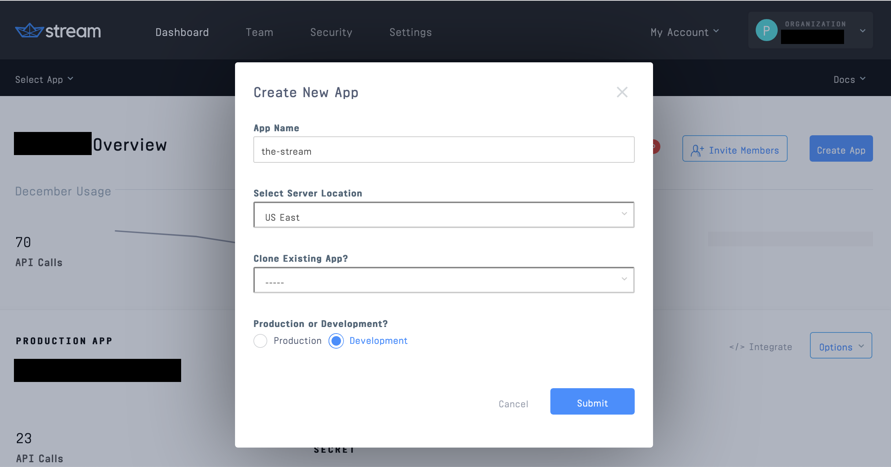
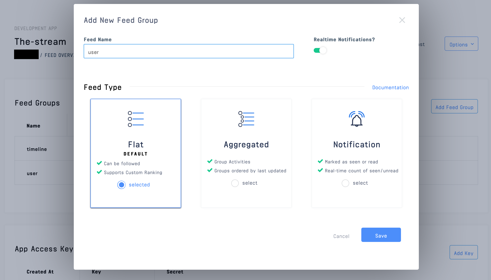
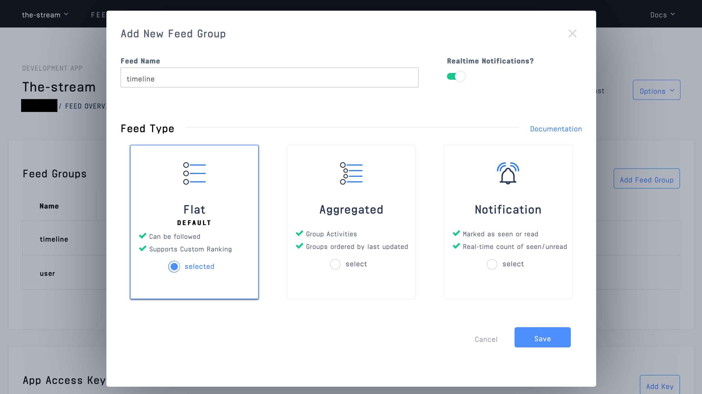
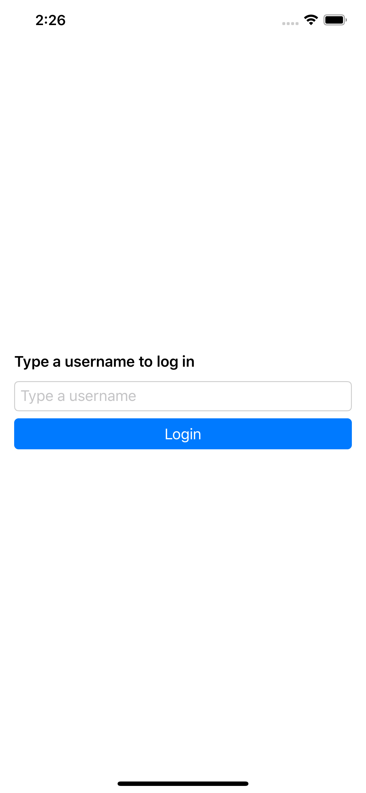
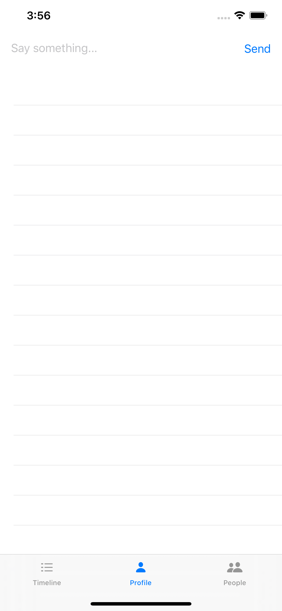
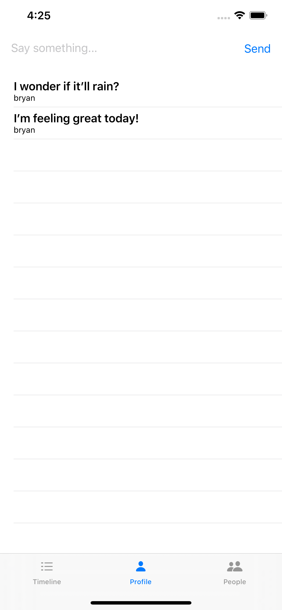
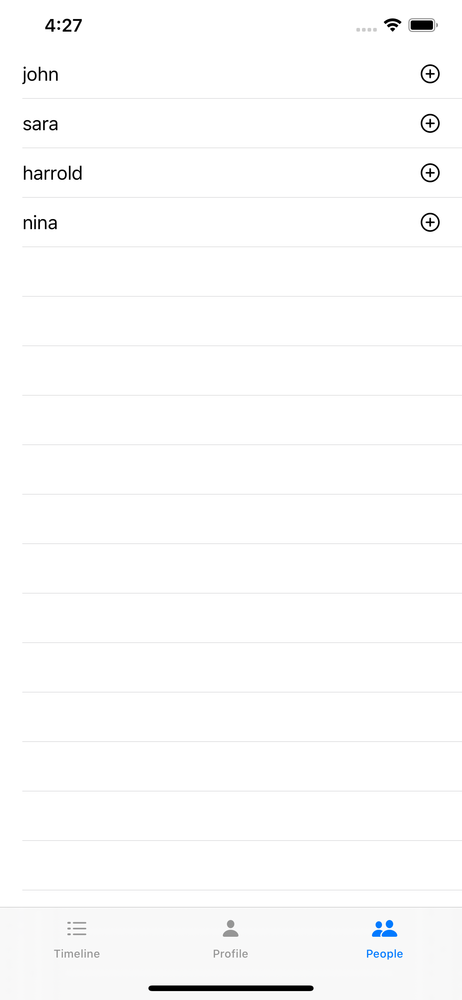
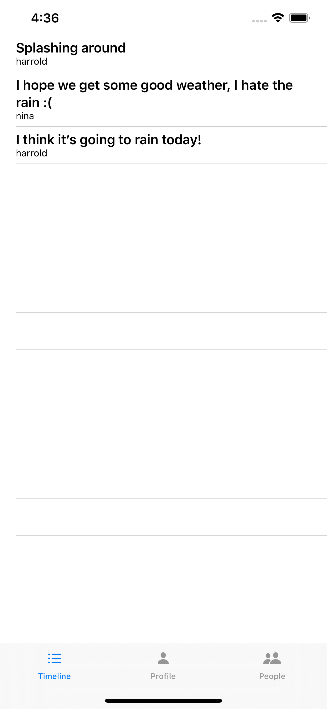

# Building a Social Network with Stream on iOS with SwiftUI

## Part 1: Activity Feeds

In this post, we'll be creating a simple social network with SwiftUI, called Stream Flutter, that allows a user to post messages to followers.

The app will allow a user to post a message to their followers and view updates from people they follow. Stream's [Activity Feed API](https://getstream.io/activity-feeds/), combined with Swift, make it straightforward to build this sort of complex interaction. All source code for this application is available on [GitHub](https://github.com/psylinse/the-stream-swiftui/). This application is fully functional on both iOS and Android.

To keep things focused, we'll be showing the more important code snippets to get the idea of each part across. Often there is context around those code snippets which are important, such as layout or navigation. Please refer to the full source if you're confused on how something works, or how we got to a screen. Each snippet will be accompanied by a comment explaining which file and line it came from.

To build our social network we'll need both a backend and a mobile application. Most of the work is done in the mobile application, but we need the backend to securely create frontend tokens for interacting with the Stream API.

For the backend, we'll rely on [Express](https://expressjs.com/) (Node.js) leveraging Stream's [JavaScript library](https://github.com/GetStream/stream-js).

For the frontend, we'll build it with Swift wrapping Stream's [Swift](https://github.com/getstream/stream-swift) library, installed via [cocoapods](https://cocoapods.org/).

In order for a user to post an update the app will perform these steps:

- The user types their name into our mobile application to log in.
- The mobile app registers the user with the `backend` and receives a Stream Activity Feed [frontend token](https://getstream.io/blog/integrating-with-stream-backend-frontend-options/).
- User types in their message and hits "Post". The mobile app uses the Stream token to create a Stream activity and connects to [Stream's REST API](https://getstream.io/docs_rest/) via the [Swift](https://github.com/getstream/stream-swift) library.
- User views their posts. The mobile app does this by retrieving its "user" feed via Stream.

If another user wants to follow a user and view their messages, the app goes through this process:

- Log in (same as above).
- The user navigates to the user list and selects a user to follow. The mobile app communicates with Stream API directly to create a [follower relationship](https://getstream.io/get_started/#follow) on their "timeline" feed.
- User views their timeline. The mobile app uses Stream API to retrieve their "timeline" feed, which is composed of all the messages from who they follow.

The code is split between the iOS mobile application contained in the `ios` directory and the Express backend is in the `backend` directory. See the `README.md` in each folder to see installing and running instructions. If you'd like to follow along with running code, make sure you get both the backend and mobile app running before continuing.

## Prerequisites

Basic knowledge of [Node.js](https://nodejs.org/en/) (JavaScript), Swift, and SwiftUI is required to follow this tutorial. This code is intended to run locally on your machine with an internet connection.

If you'd like to follow along, you'll need an account with [Stream](https://getstream.io/accounts/signup/). Please make sure you can run an iOS app. If you haven't done so, make sure you have XCode 11+ [installed](https://developer.apple.com/xcode/). If you're having issues building this project, feel free to open an issue on [GitHub](https://github.com/psylinse/the-stream-swiftui/issues). If you're unfamiliar with SwiftUI, it may help to go through a [tutorial](https://developer.apple.com/tutorials/swiftui/tutorials) before following along. The SwiftUI previews are unreliabale at the time of this writing, so don't worry if you they aren't working for you.

You also need to have the `backend` running. Please follow the instructions in the `backend` readme to see how to get it going.

Once you have an account with Stream, you need to set up a development app:



You also need to set up two flat Feeds, "user" and "timeline", in of stream:





You'll need to add the credentials from the Stream app to the source code for it to work and set up [ngrok](https://ngrok.com/). See both the `ios` and `backend` readmes.

Let's get to building!

## User Posts a Status Update

We'll start by allowing a user to post a status update, also known as a activity in Stream lingo.

### Step 1: Login

To communicate with the Stream API, we need a secure frontend token that allows our mobile application to authenticate with Stream directly. This avoids having to proxy through the `backend`. To do this, we'll need a backend endpoint that uses our Stream account secrets to generate this token. Once we have this token, we don't need the backend to do anything else, since the mobile app has access to the full Stream API.

First, we'll be building the login screen which looks like this:



To start let's layout our form in SwiftUI. In our `ContentView`, which is instantiated in `SceneDelegate.swift:22` (seen below), we'll create a simple check to see if we're logged in, and show the login form if we're not:

```swift
// ios/TheStream/ContentView.swift:3
struct ContentView: View {
    @State var user = ""
    @EnvironmentObject var account: Account
    
    private func login() {
        account.login(user)
    }
    
    @ViewBuilder
    var body: some View {
        if account.isAuthed {
            // ...
        } else {
            VStack(alignment: .leading) {
                Text("Type a username to log in")
                    .font(.headline)
                TextField("Type a username", text: $user, onCommit: login)
                    .textFieldStyle(RoundedBorderTextFieldStyle())
                    .autocapitalization(.none)
                    .disableAutocorrection(true)
                Button(action: login) { Text("Login") }
                    .frame(maxWidth: .infinity, maxHeight: 35)
                    .foregroundColor(Color.white)
                    .background(Color.blue)
                    .cornerRadius(5)
            }.padding()
        }
    }
}
```

We have a simple `@State` var that is bound to a `TextField` to store what the user types. When clicking "Login" we'll call our function `.login` which in turn calls `@EnvironmentObject` `Account.login`. This `Account` object is essentially a service object that contains our business logic and account data. For simplicity, this object will contain all business logic. In a real application, you'd likely want to split it up. The `Account` object is given in our `SceneDelegate` during the scene setup (in this case there's only 1 scene in our case so it's effectively our application setup):

```swift
// ios/TheStream/SceneDelegate.swift:22
let contentView = ContentView().environmentObject(Account())

// Use a UIHostingController as window root view controller.
if let windowScene = scene as? UIWindowScene {
    let window = UIWindow(windowScene: windowScene)
    window.rootViewController = UIHostingController(rootView: contentView)
    self.window = window
    window.makeKeyAndVisible()
}
```

This instance is injected to our `View` via the `@EnvironmentObject` property wrapper. Now let's look at the implementation of `Account.login`:

```swift
func login(_ userToLogIn: String) {
    Alamofire
        .request("\(apiRoot)/v1/users",
            method: .post,
            parameters: ["user" : userToLogIn],
            encoding: JSONEncoding.default)
        .responseJSON { [weak self] response in
            print(response)
            let body = response.value as! NSDictionary
            let authToken = body["authToken"]! as! String
            
            
            self?.user = userToLogIn
            self?.authToken = authToken
            self?.setupFeed()
    }
}
```

Here we use [AlamoFire](https://github.com/Alamofire/Alamofire) to make an HTTP request to our `backend` to give us an auth token. We'll use this auth token to communicate with other API endpoints. The user registration endpoint in the `backend` simply stores the user in memory and generates a simple token for auth. This is not a real implementation and should be replaced by authentication and user management works for your application. Because of this, we won't go into detail here (please refer to the [source code](https://github.com/psylinse/the-stream-swiftui/blob/1-social/backend/src/controllers/v1/users/users.action.js#L26-L37) if you're interested).

Once we've stored the logged in user and auth token, we're ready to set up Stream Feed. The last line of `.login` calls `.setupFeed`:

```swift
private func setupFeed() {
    Alamofire
        .request("\(apiRoot)/v1/stream-feed-credentials",
            method: .post,
            headers: ["Authorization" : "Bearer \(authToken!)"])
        .responseJSON { [weak self] response in
            let body = response.value as! NSDictionary
            let feedToken = body["token"]! as! String
            let appId = body["appId"] as! String
            let apiKey = body["apiKey"] as! String
            
            if let user = self?.user {
                GetStream.Client.config = .init(apiKey: apiKey,
                                                appId: appId)
                
                
                GetStream.Client.shared.setupUser(
                    GetStreamActivityFeed.User(name: user,
                                               id: user),
                    token: feedToken
                ) { [weak self] (result) in
                    self?.userFeed = Client.shared.flatFeed(feedSlug: "user")
                    self?.timelineFeed = Client.shared.flatFeed(feedSlug: "timeline")
                    
                    self?.isAuthed = true
                }
            }
    }
}
```

Once again, we use `AlamoFire` to send an HTTP request to our backend to get the Stream Feed Credentials. We use the auth token from before to authenticate the request. The response gives us our Stream frontend token, so we can interact with the Stream API directly, the Stream App ID, and Stream API Key. We use this data to initialize Stream Activity Feed Client. We also set our user up so Stream knows what user is communicating with the API and store the feed token to authenticate further requests. The function finishes with storing references to two feeds that we'll use, the user feed and timeline feed. We'll see how these are used later. We then indicate that we're authed by setting `.isAuthed` which allows our view to know when we're ready to move on. 

Now that we're logged in and authenticated with Stream, we're ready to post our first activity! 

### Step 2: Creating a Status Message

Now we'll build the form to post a status message to our Stream activity feed. First we need to implement the navigation so we can get to our Profile page. We'll use a `TabView` to handle multiple screens:

```swift
// ios/TheStream/ContentView.swift:13
if account.isAuthed {
    TabView {
        TimelineView()
            .tabItem {
                Image(systemName: "list.dash")
                Text("Timeline")
        }
        ProfileView()
            .tabItem {
                Image(systemName: "person.fill")
                Text("Profile")
        }
        PeopleView()
            .tabItem {
                Image(systemName: "person.2.fill")
                Text("People")
        }
    }
} else {
  // ....
}
```

We'll focus on `ProfileView` to start since this is where we create messages and view our activity feed.  We'll need to build a form to create the users status update and a `FeedView` which shows all of our updates which looks like:



And here's the `View` code:

```swift
struct ProfileView: View {
    @State var message: String = ""
    @State var items: [FeedItem] = []
    @EnvironmentObject var account: Account
    
    var body: some View {
        VStack() {
            HStack() {
                TextField("Say something...", text: $message, onCommit: createFeedItem)
                Button(action: createFeedItem) { Text("Send") }
            }.padding()
            FeedView(items: items)
        }.onAppear(perform: fetch)
    }
    
    private func createFeedItem() {
        account.createFeedItem(message) { self.fetch() }
        message = ""
    }
    
    private func fetch() {
        account.fetchFeed(.profile) { items in
            self.items = items
        }
    }
}
```

This view has two `@State` properties which contain the message we want to send and a list of our previous feed items (previously sent items).  First, we bind `message` to a `TextField` and call to up `account.createFeedItem` action when the users submits:

```swift
// ios/TheStream/Account.swift:55
func createFeedItem(_ message: String, completion: @escaping () -> Void) {
    let activity = FeedItem(actor: User(id: self.user!), verb: "post", object: UUID().uuidString, message: message)
    
    userFeed?.add(activity) { result in
        completion()
    }
}
```

This creates a `FeedItem` and adds that to the `userFeed` set up during `Account.login`. `FeedItem` is a simple data object which serializes our data for Stream correctly:

```swift
// ios/TheStream/FeedItem.swift
final class FeedItem: EnrichedActivity<GetStream.User, String, DefaultReaction>, Identifiable {
    private enum CodingKeys: String, CodingKey {
        case message
    }
    
    var message: String
    
    init(actor: GetStream.User, verb: Verb, object: ObjectType, message: String) {
        self.message = message
        super.init(actor: actor, verb: verb, object: object)
    }
    
    required init(from decoder: Decoder) throws {
        let container = try decoder.container(keyedBy: CodingKeys.self)
        message = try container.decode(String.self, forKey: .message)
        try super.init(from: decoder)
    }
    
    required init(actor: ActorType, verb: Verb, object: ObjectType, foreignId: String? = nil, time: Date? = nil, feedIds: FeedIds? = nil, originFeedId: FeedId? = nil) {
        fatalError("init(actor:verb:object:foreignId:time:feedIds:originFeedId:) has not been implemented")
    }
    
    override public func encode(to encoder: Encoder) throws {
        var container = encoder.container(keyedBy: CodingKeys.self)
        try container.encode(message, forKey: .message)
        try super.encode(to: encoder)
    }
}
```

This looks complicated, but it's simply a class declaring that we have a Stream Activity which contains a user and a message. This class tells the Stream library how to serialize and deserialize our activity which contains a `String` message. 

Once we've sent this message to stream, we call the given completion to indicate success, which in our `ProfileView` calls a `fetch`. We also do this fetch when the View first loads via `.onAppear` to load the initial feed. Let's see the implementation of `Account.fetchFeed(.profile)`:

```swift
// ios/TheStream/Account.swift:40
func fetchFeed(_ feedType: FeedType, completion: @escaping (_ result: [FeedItem]) -> Void) {
    let feed: FlatFeed = {
        switch(feedType) {
        case .profile:
            return userFeed!
        case .timeline:
            return timelineFeed!
        }
    }()
    
    feed.get(typeOf: FeedItem.self, pagination: .limit(50)) { r in
        completion(try! r.get().results)
    }
}
```

We find the correct feed to use and return the last 50 items from that feed and pass it back via our completion. In the `View` we pass those items to the `FeedView`:

```swift
// ios/TheStream/FeedView.swift:6
struct FeedView: View {
    var items: [FeedItem]
    
    var body: some View {
        List {
            ForEach(items) { item in
                FeedRow(item: item)
            }
        }
    }
}
```

This is a simple `List` which uses `FeedRow`:

```swift
// ios/TheStream/FeedView.swift:18
struct FeedRow: View {
    var item: FeedItem
    
    var body: some View {
        VStack(alignment: .leading) {
            Text(item.message)
                .font(.headline)
            Text(item.actor.id)
                .font(.caption)
        }.frame(minWidth: 0, maxWidth: .infinity, minHeight: 0, maxHeight: .infinity, alignment: .topLeading)
    }
}
```

The `FeedRow` simply displays the message and author. With all of those pieces put together we can now see our messages:



Next, we'll see how to follow multiple users via a timeline feed and see all of their messages.

## User Timeline

Now that users can post messages, we'd like to follow a few and see a combined feed of all the messages for users we follow.

### Step 1: Follow a User

The first thing we need to do is view a list of users and pick a few to follow. We'll start by creating a view that shows all the users and lets a user follow a few. Here is the screen that shows all the users:



And here's the code that backs it:

```swift
// ios/TheStream/PeopleView.swift:3
struct PeopleView: View {
    @EnvironmentObject var account: Account
    @State var users: [String] = []
    @State var showFollowedAlert: Bool = false
    @State var tag: Int? = nil
    
    var body: some View {
        List {
            ForEach(users.indices, id: \.self) { i in
                HStack() {
                    Text(self.users[i])
                    Spacer()
                    Image(systemName: "plus.circle").onTapGesture {
                        self.account.follow(self.users[i]) {
                            self.showFollowedAlert = true
                        }
                    }
                }
            }
        }
        .onAppear(perform: fetch)
        .alert(isPresented: $showFollowedAlert) {
            Alert(title: Text("Followed"))
        }
        
    }
    
    private func fetch() {
        account.fetchUsers { users in
            self.users = users.filter { $0 != self.account.user! }
        }
    }
}
```

This SwiftUI `View` is a `List` that shows the user and a button to follow. When the user clicks follow, we tell the account to follow that user and show an `Alert`. The initial `onAppear` fetch is a simple HTTP call to our `backend` to get the list of users that have registered. Since this is not a real implementation, we won't delve into it here. Please refer to the source if you're curious. Let's look at `Account.follow` to see how we tell Stream to create a follower relationship:

```swift
func follow(_ user: String, completion: @escaping () -> Void) {
    timelineFeed!.follow(
        toTarget: Client.shared.flatFeed(feedSlug: "user", userId: user).feedId
    ) { result in
        completion()
    }
}
```

Since we set our `timelineFeed` up during `Account.login`, we simply use that feed object to do the work. We're adding a [follow relationship](https://getstream.io/docs/#following) to another user's "user" feed to this user's "timeline" feed. All this means is anytime another user post to their "user" feed (implemented in the first part) we'll see it on our "timeline" feed, since our feed now follows theirs. The cool part is, we can add any number of users feeds to our "timeline" feed and Stream will return a well-ordered list of activities.

If you don't see anyone in your user list, this is likely because you only have 1 user registered. Make sure you restart the application and log in/register as a different user. 

### Step 2: View Timeline

Now that we have a way to follow users we can view our timeline:



Let's look at the code to display our timeline:

```swift
// ios/TheStream/TimelineView.swift:3
struct TimelineView: View {
    @State var items: [FeedItem] = []
    @EnvironmentObject var account: Account
    
    var body: some View {
        FeedView(items: items)
            .onAppear(perform: fetch)
    }
    
    private func fetch() {
        account.fetchFeed(.timeline) { items in
            self.items = items
        }
    }
}
```

The cool thing is since we already built our `FeedView` for our `ProfileView`, we're done. We simply fetch the `.timeline` feed items and display them with the `FeedView`.

And that's it! We now have a fully functioning mini social network.
