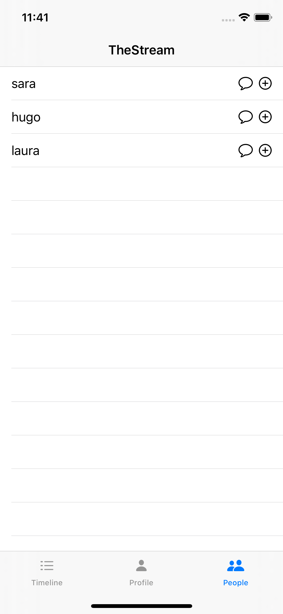
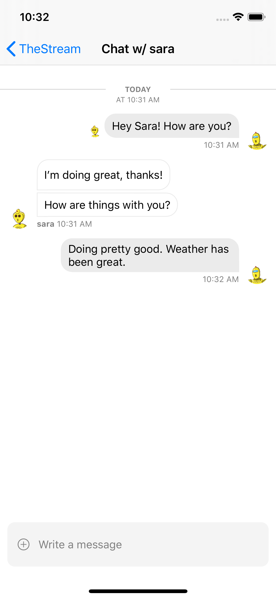

# Building a Social Network with Stream on iOS with SwiftUI
## Part 2: Direct Messaging

In the second part of our series, we'll implement direct messaging between users by integrating [Stream Chat](https://getstream.io/chat/). This post assumes you've followed along with [part 1](https://github.com/psylinse/the-stream-swiftui/tree/1-social). 

Leveraging our code from part 1, we'll modify the backend to generate a Stream Chat frontend token so our mobile application can communicate directly with Stream's Chat API. The Stream Chat frontend token securely authenticates a client application with the Stream Chat so it can directly talk with the API without going through our backend. This token is created and stored as a part of the login process which is defined in part 1. 

For this part, we'll use Stream's UI components instead of building the views ourselves to see the great UI experience we get out of the box.

For the backend, we'll add in the [Stream Chat JavaScript](https://www.npmjs.com/package/stream-chat) library. 

For the mobile app, we'll build it with Swift wrapping the Stream Chat [Swift](https://github.com/GetStream/stream-chat-swift) libraries.

The app goes through these steps to allow a user to chat with another:

* User navigates to the user list, selects a user, and clicks "Chat". The mobile application joins a 1-on-1 chat channel between the two users.
* The app queries the channel for previous messages and indicates to Stream that we'd like to watch this channel for new messages. The mobile app listens for new messages.
* The user creates a new message and sends it to the Stream API. 
* When the message is created, or a message from the other user is received, the mobile application consumes the event and displays the message.

Since we're relying on the Stream mobile libraries to do the heavy lifting, most of this work happens in the Stream Chat UI Components. If you'd like to follow along, make sure you get both the backend and mobile app running part 1 before continuing.

## Selecting a User to Chat With
### Step 1: Adding Navigation

For this app, the chat view is it's own screen, meaning there is not tab bar when chatting. To support this we first wrap our `TabView` inside of `ContentView` with a `NavigationView`:

```swift
// ios/TheStream/ContentView.swift:11 
@ViewBuilder
var body: some View {
    if account.isAuthed {
        NavigationView {
            TabView {
                TimelineView()
                    .tabItem {
                        Image(systemName: "list.dash")
                        Text("Timeline")
                }
                ProfileView()
                    .tabItem {
                        Image(systemName: "person.fill")
                        Text("Profile")
                }
                PeopleView()
                    .tabItem {
                        Image(systemName: "person.2.fill")
                        Text("People")
                }
            }
            .navigationBarTitle("TheStream", displayMode: .inline)
        }
    } else {
        // ...
    }
}
```

This `NavigationView` wrapper allows us to push new views on the stack and provides transitions and a back button. Since we have a nice navigation bar, we add a small title to the application. The list of people now looks like this:



Notice the nice navigation bar at the top now. This is present on all screens now and automatically provides a back button if we push a new view on the navigation stack, such as our 1-on-1 chat. Let's see push a new view on the stack

### Step 2: Starting a Chat

Now that we have a `NavigationView` at the top of our heirarchy, we can build a `NavigationLink` to show the chat. Since we'd like to preserve the follow action, we'll place a start chat icon next to the follow icon. We'll also make the whole row clickable. This means that unless the user explicitly clicks the follow icon, we'll start a chat. Here's the `PeopleView` code now:

```swift
// ios/TheStream/PeopleView.swift:3
struct PeopleView: View {
    @EnvironmentObject var account: Account
    @State var users: [String] = []
    @State var showFollowedAlert: Bool = false
    @State var tag: Int? = nil
    
    var body: some View {
        List {
            ForEach(users.indices, id: \.self) { i in
                HStack() {
                    Text(self.users[i]).onTapGesture {
                        self.tag = i
                    }
                    NavigationLink(destination: PrivateChatView(user: self.account.user!, withUser: self.users[i]), tag: i, selection: self.$tag) {
                        Spacer()
                    }
                    Image(systemName: "message").onTapGesture {
                        self.tag = i
                    }
                    Image(systemName: "plus.circle").onTapGesture {
                        self.account.follow(self.users[i]) {
                            self.showFollowedAlert = true
                        }
                    }
                }
            }
        }
        .onAppear(perform: fetch)
        .alert(isPresented: $showFollowedAlert) {
            Alert(title: Text("Followed"))
        }
        
    }
    
    private func fetch() {
        account.fetchUsers { users in
            self.users = users.filter { $0 != self.account.user! }
        }
    }
}
```

The navigation is done by the `NavigationLink` embedded in the row. Since we give the content of the `NavigationLink` a `Spacer` this forces the icons to align right, while giving the whole row a clickable area. Each link is tagged with it's index allowing us to "select" it when a user clicks the name or the message icon.

When a user clicks, the `NavigationLink` pushes a `PrivateChatView` onto the navigation stack. By using these built in navigation views, we get a nice transition (swipe animation) to the next view with a back button built for us. Now we simple add our chat view in and we're done!

## Viewing a Chat
### Step 1: Creating a Channel
First, we create a channel via Streams' library. The job of `PrivateChatChannel` is to create the channel and feed it to our `StreamChatView` (defined below). Let's look at the code for `PrivateChatView`:

```swift
// ios/TheStream/PrivateChatView.swift:5
struct PrivateChatView: View {
    var user: String
    var withUser: String

    @EnvironmentObject var account: Account
    @State var channel: Channel?
    
    @ViewBuilder
    var body: some View {
        if (channel == nil) {
            Text("Loading...").onAppear(perform: loadChannel)
        } else {
            StreamChatView(channelPresenter: ChannelPresenter(channel: channel!))
                .navigationBarTitle("Chat w/ \(withUser)")
        }
    }
    
    private func loadChannel() {
        account.createPrivateChannel(user, withUser) { channel in
            self.channel = channel
        }
    }
}
```
We check if the channel has been initialized. If it's not, we show a loading screen and perform `loadChannel`. This calls to `account.createPrivateChannel`. Here's the implementation:

```swift
// ios/TheStream/Account.swift:86
func createPrivateChannel(_ user: String, _ withUser: String, completion: @escaping (Channel) -> Void) {
    let users = [user, withUser]
    let channelId = users.sorted().joined(separator: "-")
    let channel = StreamChatClient.Client.shared.channel(
        type: .messaging,
        id: channelId,
        members: users.map { StreamChatClient.User(id: $0) }
    )
    
    channel.create { (result) in
        completion(try! result.get().channel)
    }
}
```

This function generates a unique channel id and sets up a private channel that contains only the two members that are chatting. It returns the channel to via the completion. 

Now that the view has a channel, it can boot a `StreamChatView`. This is a view that wraps Steam's `ChatViewController`.


### Step 2: Wrapping Stream's UI Components
In the first part of this series we built our timeline view from scratch. In this part, we'll wrap Stream's UI components to makke our jobs easier. Stream provides convenient components to render a great chat experience with little work. There are no SwiftUI components yet, however, using Swift's built in support for `UIControllers` we can easily wrap Stream's library. Let's see the code for `StreamChatView`:

```swift
// ios/TheStream/PrivateChatView.swift:30
struct StreamChatView: UIViewControllerRepresentable {
    var channelPresenter: ChannelPresenter
    
    func makeUIViewController(context: UIViewControllerRepresentableContext<StreamChatView>) -> ChatViewController {
        let vc = ChatViewController()
        vc.presenter = channelPresenter
        return vc
    }

    func updateUIViewController(_ uiViewController: ChatViewController, context: UIViewControllerRepresentableContext<StreamChatView>) {
        
    }
}
```

We use SwiftUI's [`UIViewControllerRepresentable`](https://developer.apple.com/documentation/swiftui/uiviewcontrollerrepresentable) which allows us to create and manage a `UIViewController`. Since Stream's high level components are `UIViewController`s this is exactly what we need to bring them into SwiftUI. 

All Stream's component needs to render is a `ChannelPresenter`. Since we instantiated this object when creating the channel, we simple use the one passed along to us by `PrivateChatChannel`. With that object we create a `ChatViewController` instance, which comes from Stream's library, and give it the `ChannelPresenter`. Now we get a full chat experience with only a few lines of work:



And we're done. Stream's built in views makes it straightforward to build a great chat experience. 