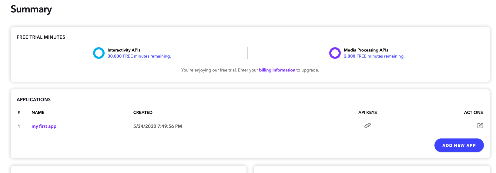
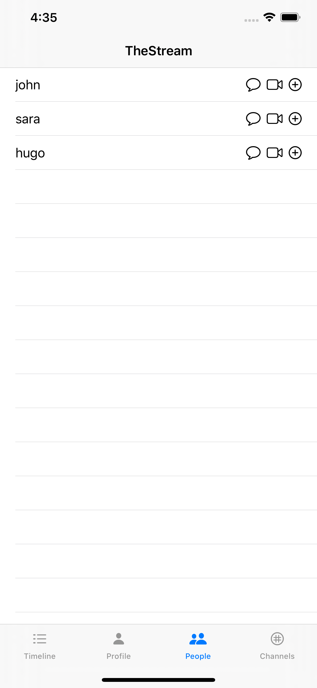
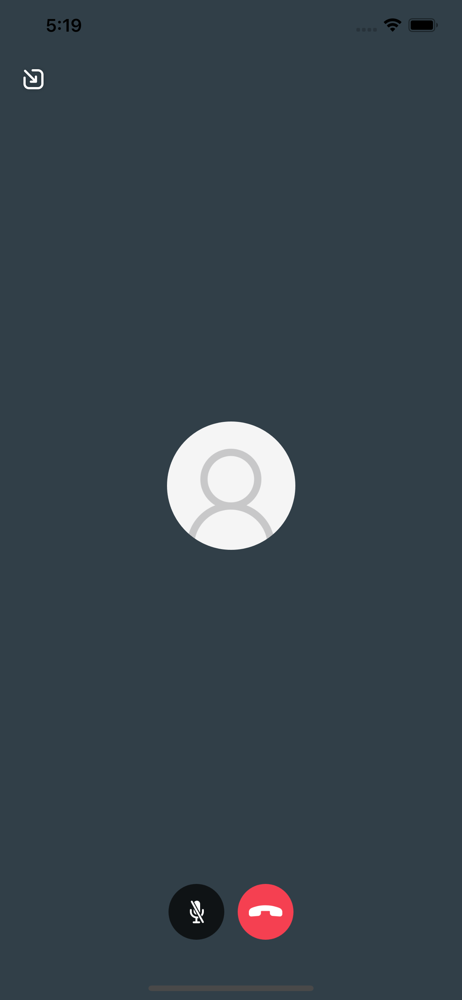

# Building a Social Network with Stream on iOS with SwiftUI
## Part 4: 1-on-1 Video Chat 

In the fourth part of our series on building a social network, we'll integrate video chat. To do this, we integrate [Dolby.io](https://dolby.io)'s [Interactivity APIs](https://dolby.io/products/interactivity-apis), formally known as [Voxeet](https://www.voxeet.com/), into our application. Note: the library is still named Voxeet.

For this part, the application will support 1-on-1 private chat. Since Dolby is a pure client-side library, we only configure our `ios` application. However, to facilitate the UI for indicating whether a user has a call waiting, we use a few endpoints in the backend. Because these are minor and largely stub implementations we don't go into them in this tutorial. Please refer to the source if you're curious. Also, ensure the backend is running if following along with this tutorial. Refer to the `backend`'s README for help.

The app performs these steps:

* Initialize Voxeet libraries
* When a user navigates to the "People" screen show a video icon next to a user's name.
* When a user clicks this icon, start and join a Voxeet conference with a unique alias. The user waits for the other party to join. The application informs the backend of the new call.
* When the other user joins following the previous steps, they'll be placed in a 1-on-1 conference. 
* When either user leaves, the call is ended in the application and the backend is informed of the call ending.

Voxeet's [UXKit](https://github.com/voxeet/voxeet-uxkit-ios) takes care of the connection and presentation for this 1-on-1 call. Our application just needs to create and join the call at the appropriate time.

Let's dive in.

### Step 1: Create a Dolby Account and Install Voxeet Dependencies

Go to [dolby.io](https://dolby.io) and create an account. Once registered, navigate to the Dashboard (you can click in the top-right if you're not there). Find the list of applications:



If you already have an app ("my first app") click into it. If you don't create an app by hitting "Add New App". Now we can grab our API key and secret for our application. The keys we need are under the "Interactivity APIs" section. :


Click on "Show Secret" to view the secret. 

Next, add `VoxeetUIKit` to our Podfile and `pod install`:

```ruby
# ios/Podfile:8
pod 'VoxeetUXKit', '~> 1.0'
```

*Note: Since the `WebRTC` dependency is larger than GitHub's file limit we did not include the Pods in the repo. Please ensure you run `pod install` before attempting to run!*

### Step 2: Configure the Voxeet UXKit Library

Since the Voxeet library is not tied to a `backend` user account, we can configure it on application load. Change the `AppDelegate` to this:

```swift
// ios/TheStream/AppDelegate.swift:1
import UIKit
import VoxeetSDK
import VoxeetUXKit

@UIApplicationMain
class AppDelegate: UIResponder, UIApplicationDelegate {
    func application(_ application: UIApplication, didFinishLaunchingWithOptions launchOptions: [UIApplication.LaunchOptionsKey: Any]?) -> Bool {
        // Voxeet SDKs initialization.
        VoxeetSDK.shared.initialize(consumerKey: "<VOXEET_CONSUMER_KEY>", consumerSecret: "<VOXEET_CONSUMER_SECRET>")
        VoxeetUXKit.shared.initialize()
        
        // Example of public variables to change the conference behavior.
        VoxeetSDK.shared.notification.push.type = .none
        VoxeetSDK.shared.conference.defaultBuiltInSpeaker = true
        VoxeetSDK.shared.conference.defaultVideo = true
        VoxeetUXKit.shared.appearMaximized = true
        VoxeetUXKit.shared.telecom = true
        
        return true
    }
    
    // ...
}
```

Change `<VOXEET_CONSUMER_KEY>` and `<VOXEET_CONSUMER_SECRET>` to the values you retrieved in Step 1. We configure Voxeet to not have any push notifications, turn on the speaker and video by default, and appear maximized. We also set `telecom` to true. When true, the conference will behave like a cellular call meaning when either party hangs up or declines the call (not implemented in this tutorial), it will end the call. 

If you'd like to use push notifications to notify a user when a call is incoming, check out [CallKit](https://developer.apple.com/documentation/callkit) combined with `VoxeetSDK.shared.notification.push.type = .callKit`. This is out of scope for this tutorial.

### Step 3: Starting a Call

Next, we add a video action to the list to people, in between the start chat and follow icons from previous parts of this series. Here's what our view will look like:



To do this we just add another image view in our `ListView` in `PeopleView`:

```swift
// ios/TheStream/PeopleView.swift:14
var body: some View {
    List {
        ForEach(users.indices, id: \.self) { i in
            HStack() {
                Text(self.users[i]).onTapGesture {
                    self.tag = i
                }
                NavigationLink(destination: PrivateChatView(user: self.account.user!, withUser: self.users[i]), tag: i, selection: self.$tag) {
                    Spacer()
                }
                Image(systemName: "message").onTapGesture {
                    self.tag = i
                }
                Image(systemName: "video")
                    .foregroundColor(self.videoIconColor(self.users[i]))
                    .onTapGesture { self.startConferenceCall(self.users[i]) }
                Image(systemName: "plus.circle").onTapGesture {
                    self.account.follow(self.users[i]) {
                        self.showFollowedAlert = true
                    }
                }
            }
        }
    }
    // ...
}
```

This is a simple system icon that we load via `systemName`. With the icon in place, we can add a click handler via `onTapGesture` to start our 1-on-1 call. Ignore the icon `foregroundColor` call for now. We'll get to that in a bit.

Let's look at `startConferenceCall`:

```swift
// ios/TheStream/PeopleView.swift:61
private func startConferenceCall(_ otherUser: String) {
    let options = VTConferenceOptions()
    let alias =  [self.account.user!, otherUser].sorted().joined(separator: "-")
    options.alias = alias
    
    VoxeetSDK.shared.conference.create(options: options, success: { conference in
        self.account.startCall(otherUser, conference.id)
        
        let joinOptions = VTJoinOptions()
        
        VoxeetSDK.shared.conference.join(conference: conference, options: joinOptions, fail: { error in print(error) })
    }, fail: { error in print(error) })
}
```

*Note: We use Voxeet's conference implementation as it's perfect to facilitate a video chat between two people. The conference object is more powerful than this (multiple users, broadcast streams, screen sharing, etc.) but here only use it for a 1-on-1 call. The terms conference and call are used interchangeably in this tutorial given the scope of our application.*

Here we create our conference call using Voxeet with an `alias`. We use this `alias` as an identifier so the other user's application knows how to join the same call. The call to `.create` yields us a conference object. First we call to our `backend` via `startCall` to register the call so the other user knows there's a call waiting. This is simply a `POST` request:

```swift
// ios/TheStream/Account.swift:118
func startCall(_ to: String, _ callId: String) {
    Alamofire
        .request("\(apiRoot)/v1/calls",
            method: .post,
            parameters: ["to" : to, "id" : callId],
            encoding: JSONEncoding.default,
            headers: ["Authorization" : "Bearer \(authToken!)"])
}
```

Once we've notified the `backend` of the call, we join the conference we just via `.join`. Since we're using Voxeet's [UXKit](https://github.com/voxeet/voxeet-uxkit-ios) a video chat UI slides up from the bottom automatically:


### Step 4: Joining a Call

Now that we've started a call with someone, we want the other user to see there's a call started so they can join. To keep things simple, we just turn the video icon red if there's a call active. Recall from above that we are changing the video icon color via `foregroundColor` via a call to `.videoIconColor`:

```swift
// ios/TheStream/PeopleView.swift:75
private func videoIconColor(_ otherUser: String) -> Color {
    if (self.calls.filter { $0["from"] as! String == otherUser }.isEmpty) {
        return Color.black
    } else {
        return Color.red
    }
}
```

Here we'll check a `@State` var `calls` for a call from the other user. If we do find one, we color the icon red. The `calls` var gets initialized when the view appears:

```swift
// ios/TheStream/PeopleView.swift:4
struct PeopleView: View {
    // ...
    @State var calls: [NSDictionary] = []
    
    // ...
    
    var body: some View {
        List {
            // ...
        }
        .onAppear(perform: fetch)
        // ...
    }
    
    private func fetch() {
        // ...
        
        account.fetchCalls { calls in
            self.calls = calls
        }
    }
}
```

We call to `account.fetchCalls` to retrieve a list of active calls for the the current user:

```swift
// ios/TheStream/Account.swift:127
func fetchCalls(completion: @escaping (_ result: [NSDictionary]) -> Void) {
    Alamofire
        .request("\(apiRoot)/v1/calls",
            method: .get,
            headers: ["Authorization" : "Bearer \(authToken!)"])
        .responseJSON { response in
            completion(response.value as! [NSDictionary])
    }
}
```

This is simply a `GET` request against our mock `backend` (refer to source). The response object will have a `from` field indicating who the user that started the call is.  

Now that we know a user is calling the user will see a screen like this:


If the user joins the call, the UXKit UI will change to show the call has started:



### Step 5: Leaving a Call

When a user is done, they simply hang up using the end call icon. We don't need to do anything special on our side to end the call, Voxeet takes care of that. We simply need to listen to the conference call ends so we can notify the backend of the change. 

*Note: In a production application you'd likely want to use Voxeet's push notifications and `CallKit` bindings, or look at binding to Dolby's Interactivity API WebSockets on the backend. While the approach below works, it is less robust than using the full Notification system built into Voxeet*

We'll bind to the notification center and listen for the conference call ending. Upon ending we'll notify the backend the call has finished:

```swift
// ios/TheStream/PeopleView.swift:

struct PeopleView: View {
    // ...
    
    let pub = NotificationCenter.default.publisher(for: .VTConferenceDestroyed)
    
    
    var body: some View {
        List {
            // ...
        }
        // ...
        .onReceive(pub) { data in
            guard let conference =  data.userInfo!.values.first as? VTConference else {return}
            
            self.account.stopCall(conference.id) {
                self.fetch()
            }
        }
        // ...
    }
    
    // ...
}
```

We use SwiftUI's convienient `.onReceive` method to bind to the NotificationCenter event `.VTConferenceDestroyed`. When this happens, we know the call has finished. Since we configured `VoxeetUXKit.shared.telecom = true` this happens simultaneously on both sides when either party hangs up. When we get the notificatoin we simply call to the backend to stop the call via `account.stopCall` and fetch the new set to refresh the view (effectively removing the red video incicator). The `stopCall` is a simple `DESTROY` call to the `backend`:

```swift
// ios/TheStream/Account.swift:137
func stopCall(_ callId: String, completion: @escaping () -> Void) {
    Alamofire
        .request("\(apiRoot)/v1/calls/\(callId)",
            method: .delete,
        headers: ["Authorization" : "Bearer \(authToken!)"])
        .response { _ in
            completion()
    }
}
```

And we're done! We now have 1-on-1 chat between two parties integrated into our application using Dolby's Voxeet offering.
